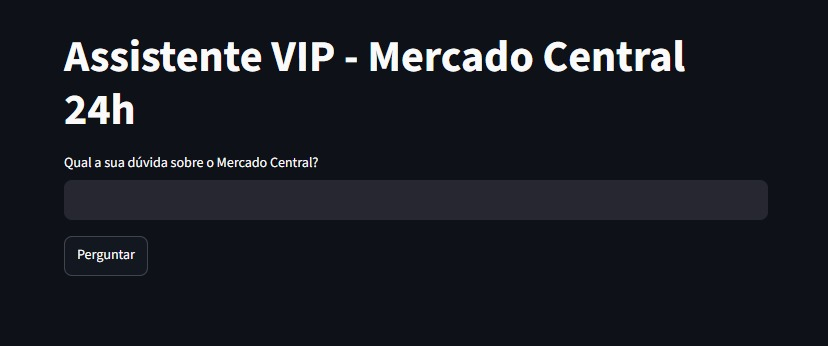
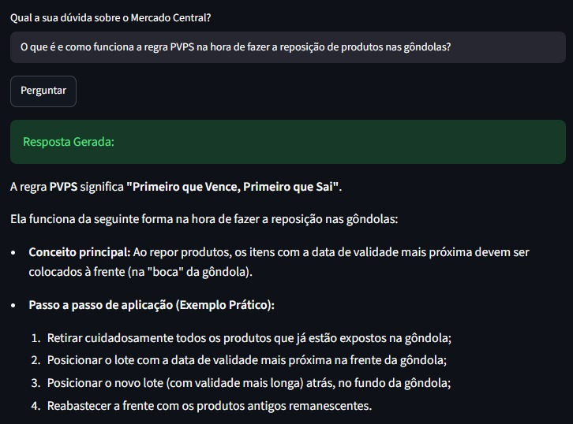
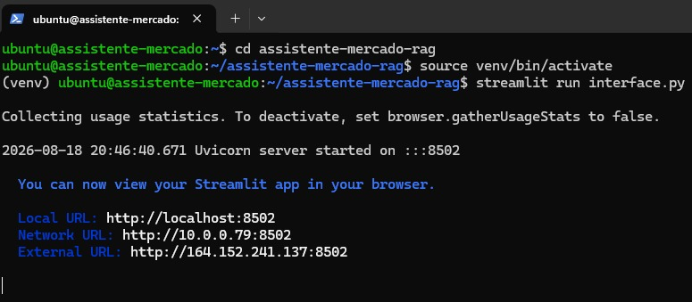

# Assistente VIP - Mercado Central 24h

Um assistente virtual inteligente baseado em RAG (Retrieval-Augmented Generation) desenvolvido para responder com precisão a dúvidas de clientes e colaboradores do Mercado Central 24h. O sistema consulta dinamicamente os regulamentos, FAQs e manuais internos da empresa para formular respostas contextualizadas.

## Tecnologias Utilizadas

* Python
* Streamlit: Construcao da interface web interativa.
* LangChain: Orquestracao do processamento de documentos e fatiamento (chunking).
* Google Gemini API: Modelo de Linguagem (LLM) responsavel pela interpretacao e geracao de respostas.
* ChromaDB / FAISS: Banco de dados vetorial para armazenamento dos embeddings.
* Oracle Cloud Infrastructure (OCI): Deploy do projeto em maquina virtual Ubuntu.

## Arquitetura e Deploy

A aplicacao foi hospedada em uma instancia na Oracle Cloud. O processo incluiu:
* Configuracao de ambiente virtual Linux.
* Liberacao de regras de firewall e Security Lists (VCN) para a porta 8501.
* Execucao em segundo plano utilizando o comando nohup para disponibilidade continua do servidor.

## Demonstracao do Assistente

### 1. Interface Principal

### 2. Resposta baseada em Documentos Internos (Processamento RAG)

### 3. Deploy na Oracle Cloud

## Como rodar localmente

1. Clone o repositorio:
git clone https://github.com/igorresende117/assistente-mercado-rag.git

2. Crie e ative o ambiente virtual:
python -m venv venv
source venv/bin/activate

3. Instale as dependencias:
pip install -r requirements.txt

4. Crie um arquivo .env na raiz do projeto e adicione sua chave de API:
GOOGLE_API_KEY=sua_chave_aqui

5. Execute a aplicacao:
streamlit run interface.py